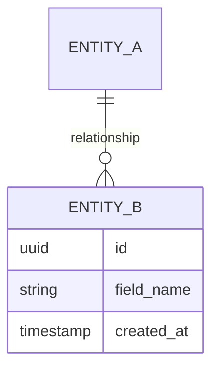
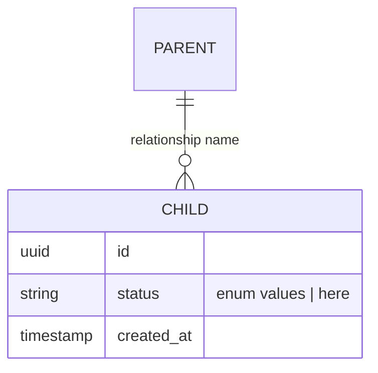

# Notion Page Template

This is the canonical structure for the spec body. Use this section order. Skipping or reordering sections breaks comparability across specs.

The template is in Notion-flavored Markdown. When publishing via `notion-create-pages`, this content goes in the `content` field.

## Spec body structure (in order)

```markdown
# [Feature Title]

**Status:** Draft · **Lane:** [Lane] · **Domain:** [Domain] · **Owner:** [PM Name] · **Spec Date:** [YYYY-MM-DD]

## Architecture Context

[Customer pool consuming this feature — which segment, V2-native only / all customers via mirror / etc.]
[Data source-of-truth — where does this feature's data live?]
[Sync direction with Salesforce — none / V2→SF one-way / SF→V2 one-way / bidirectional. If none, say so explicitly.]

## Dependencies

[Numbered list of other initiatives that must ship before this one. Include owner/status. If none, say "None — this initiative is self-contained."]

## Problem & Why Now

[Forcing functions — what makes this the right time. Cite the SF data. 2–4 paragraphs max.]

## Users & Jobs to be Done

**[User Role 1]**
- As a [role], I want to [goal] so that [outcome]
- [Additional JTBDs for this role]

**[User Role 2]**
- [Same format]

## Business Case

**Method.** [One paragraph describing the SF query — Product Tag matched, Product Feature record IDs matched, time window (3 years), Implementation Cases excluded via `Request_Category__c != 'Implementation Cases'`.]

### Cases by Request Category

| Request Category | Cases | Distinct Accounts |
|---|---|---|
| (null — not categorized) | [N] | [N] |
| New Feature Request | [N] | [N] |
| Technical Issue / System Error | [N] | [N] |
| Questions | [N] | [N] |
| Automation / Service Request | [N] | [N] |
| Documentation / Learning Request | [N] | [N] |
| Reports | [N] | [N] |
| **Total** | **[N]** | **[N] unique** |

### Cases by Case Priority

*Include this table only if the matched cases have meaningful spread across Case Priority buckets. If one bucket holds 80%+ of cases, replace the table with a one-line note: "Case Priority breakdown skipped — [N]% of cases are tagged '[bucket]'; no meaningful spread."*

| Case Priority | Cases | Distinct Accounts |
|---|---|---|
| 1. Compliance | [N] | [N] |
| 2. Strategic Growth | [N] | [N] |
| 3. Feature Parity | [N] | [N] |
| 4. Customer Delight | [N] | [N] |
| 5. Not Applicable | [N] | [N] |

### Cases by Severity

*Include this table only if the matched cases have meaningful spread across Severity buckets. If one bucket holds 80%+ of cases, replace the table with a one-line note: "Severity breakdown skipped — [N]% of cases are tagged '[bucket]'; no meaningful spread."*

| Severity | Cases | Distinct Accounts |
|---|---|---|
| Business Stopping | [N] | [N] |
| Critical | [N] | [N] |
| High | [N] | [N] |
| Medium | [N] | [N] |
| Low | [N] | [N] |

**Deduplicated ARR exposure:** ~$[X]M across [N] accounts — **~[Y]% of the company's ~$[YOUR_ARR]M ARR base** has raised at least one client-driven case on the matched Product Feature(s) in the last 3 years.

**Top concentration:** [observation about case distribution]

**Data caveat.** Request_Category, Case Priority, and Severity have varying fill rates across the case base; figures are based on matched `Product_Feature__c` records and exclude Implementation Cases. The null bucket on Request Category is expected — it does not invalidate the signal.

## Non-Goals

- [Explicit out-of-scope item 1]
- [Item 2 — attribute to owning initiative if applicable, e.g., "Email engine work (separate initiative, [Name])"]
- [Item 3]

## Success Metrics

**Leading**
- [Metric with specific target, e.g., "% of new memberships issued a digital card within 7 days — target ≥ 80% at activated accounts"]
- [Metric 2]

**Lagging**
- [Metric 1]
- [Metric 2]

## Deliverables

**Estimation formula:** `(scope × complexity × risk) / velocity`, where scope is PRs (S=1-2, M=3-5, L=6-10, XL=10+), complexity is 1× baseline / 1.5× cross-domain / 2× novel pattern, risk is 1× known / 1.3× integration / 1.5× SF↔V2 dual-write, velocity is 4 merged PRs/week per agent+human pair. Output is pair-weeks of effort.

**Deliverable sizing:** Each deliverable must be the thinnest vertical slice that delivers value to customer-org staff, visitors/members, OR the internal team (latter only when work compounds across customers). Name deliverables for what a user can DO after they ship, not for what code gets written. "Member views digital card in portal" — yes. "Wallet pass backend service" — no, unless the backend is a public API consumed by external developers.

### D1 · [Action-Object phrasing — e.g., "Member views digital card in portal"]
**User category.** [Customer-org staff / Member-Visitor / internal team — pick one or more. If internal team, justify how it compounds across customers.]
**Scope.** [What this deliverable builds. Include any shared infrastructure built incrementally inside this slice. Be specific about what's included and what's deferred to later deliverables.]
**Value.** [What a user in the named category can do after this ships. One sentence.]
**Estimate.** [Scope X (N PRs) × Complexity Y× (reason) × Risk Z× (reason) / Velocity 4 = **N.N pair-weeks**]
**QA.** [Layers in scope: unit, integration, E2E, manual exploratory, perf, regression. Be specific. Unit coverage targets go here, not in Acceptance Criteria.]
**QA estimate.** [N PRs × multiplier / 4 = **N.N pair-weeks**]
**Acceptance Criteria.** See [AC-D1-01 through AC-D1-{NN}](#acceptance-criteria-d1) below.

### D2 · [Next vertical slice — e.g., "Staff configures digital card per membership type"]
[Same structure, including a back-link to its acceptance criteria. If D2 reuses infrastructure built in D1, note it in the complexity reasoning — multiplier drops one notch per the reuse discount.]

[Continue for D3, D4, ...]

### Totals

| | Dev pair-weeks | QA pair-weeks | Combined |
|---|---|---|---|
| Sum | **[X.XX]** | **[Y.YY]** | **[Z.ZZ]** |

**Calendar read.** [Identify the critical path. Estimate elapsed time with 2 pairs and with 3 pairs. Note dependencies between deliverables.]

## Data Model



[Always include a Mermaid ER diagram. Show the new entities this spec introduces and their relationships to existing entities.]

## Flow Diagrams (optional)

[Add a Mermaid sequence or flowchart diagram ONLY when the feature has genuine sequencing or branching that's not obvious from prose. Do not add diagrams for decoration.]

## Risks

| Risk | Likelihood | Impact | Mitigation |
|---|---|---|---|
| [Specific risk, not vague] | High/Med/Low | High/Med/Low | [Concrete mitigation, often "spike in week 1" or "Architecture Review Board review before [deliverable]"] |

[At least 4–6 risks. Include the standard ones for the lane — pass cert rotation, scanner regression, PII on lock screen, API quota — when applicable.]

## Architecture Alignment

- **ADR-[N] ([principle]):** [How this spec applies the ADR.]
- **Architecture Principles in play:** [Event-driven / multi-tenant / security-by-default / etc.]
- **New ADR likely triggered?** [Yes/No — describe the question that may need a new ADR.]

## Cross-References

- SF Cases — top 5 by volume: [link the 5 highest-case-count Account IDs at publish time, or "to be linked"]
- ADRs: [list relevant ADR Notion links]
- Dependent initiatives: [list links]
- Related specs: [list links to related Product Specs]

## Acceptance Criteria

Gherkin scenarios that define "done" for each deliverable. Generated exhaustively across structured axes; pruned through PM and tech-lead review. Numbered AC-D{deliverable number}-{sequence}.

### Acceptance Criteria — D1

*Generated NN scenarios across applicable axes: [axes used with counts]. Skipped axes: [axes skipped with one-line justification each].*

#### Axis: JTBD coverage

##### AC-D1-01 · [Scenario name — short, specific]

**Axis.** JTBD coverage

**Description.** [Plain-English paragraph: what this scenario verifies and why it matters. For human reviewers — they should be able to read this and understand the test without parsing Gherkin.]

**Type.** Happy path

**Maps to JTBD.** [Formal JTBD record name(s), e.g., "Member Benefit Access"]

​```gherkin
Scenario: [Scenario name]
  Given a member with an active Gold membership
  And the account has digital cards enabled for Gold tier
  When the member logs into the portal
  Then their digital Gold membership card is visible in the "My Cards" view
  And the "Add to Apple Wallet" button is shown for iOS users
  And the "Add to Google Wallet" button is shown for Android users
​```

##### AC-D1-02 · [Next JTBD coverage scenario]

[Same structure. One scenario per JTBD minimum on this axis.]

#### Axis: Authorization

##### AC-D1-{NN} · [Scenario name]

**Axis.** Authorization

**Description.** [...]

**Type.** Error path

**Maps to JTBD.** n/a

​```gherkin
Scenario: [Scenario name]
  Given a logged-out visitor
  When they navigate directly to the /portal/my-cards URL
  Then they are redirected to the login page
  And no card data is exposed in the page source
​```

#### Axis: Data state

[Scenarios covering empty / partial / full / oversized / malformed / various entity states. Each follows the same format.]

#### Axis: Boundaries

[Scenarios covering first / last / at-limit / over-limit / exactly-zero / exactly-one cases.]

#### Axis: Failure modes

[Scenarios covering third-party down, timeout, rate limit, dependency unavailable, etc.]

[Other applicable axes in order: Concurrency, Platform, Localization — only when applicable.]

*Soft warning, if applicable: "Note: NN scenarios for D1 is high. Consider whether D1 should be split into two narrower deliverables." Only include this note when scenario count > 30.*

### Acceptance Criteria — D2

[Same structure: axes summary, then scenarios grouped by axis.]

[Continue for each deliverable.]

```

## Mermaid conventions

**Always include the data model** — it forces clarity on what entities and relationships this spec introduces.



**Add a sequence diagram** when:
- The feature has a multi-step interaction with timing constraints
- Multiple services coordinate to produce a single outcome
- An error path materially differs from the happy path

**Add a flowchart** when:
- There's branching logic (e.g., new client onboarding vs. existing client migration)
- Configuration choices change the system behavior in non-obvious ways

**Do not add a diagram** just to fill space. Prose is fine when it's clear.

## Property mapping for Notion publish

When calling `notion-create-pages`, set these properties (refer to SKILL.md for the full call structure):

| Notion property | Source | Type |
|---|---|---|
| Title | Spec title | string |
| Status | Always "Draft" on publish | status option name |
| Lane | From Round 1 | select option name |
| Domain | From Round 1 | select option name |
| Owner | PM name (needs user ID — ask if unknown) | people |
| date:Spec Date:start | Today, ISO format | date string |
| date:Spec Date:is_datetime | 0 | integer |
| ARR Exposure | Deduplicated $ figure | number |
| Client Cases | Total count excluding Implementation Cases | number |
| Distinct Accounts | Unique accounts touched | number |
| Dev Pair-Weeks | Sum of all D# Dev estimates | number |
| QA Pair-Weeks | Sum of all D# QA estimates | number |

`Total Pair-Weeks` and `Spec ID` are auto-computed by Notion.

## What good looks like

A spec that lets a domain team start work without going back to the PM for clarification. Specifically:

- Every JTBD is addressable by at least one deliverable
- Every deliverable is testable, vertically sliced, and has a justified estimate
- Every risk has a concrete mitigation
- Architecture Context is unambiguous about data flow
- Dependencies are named, not implied
